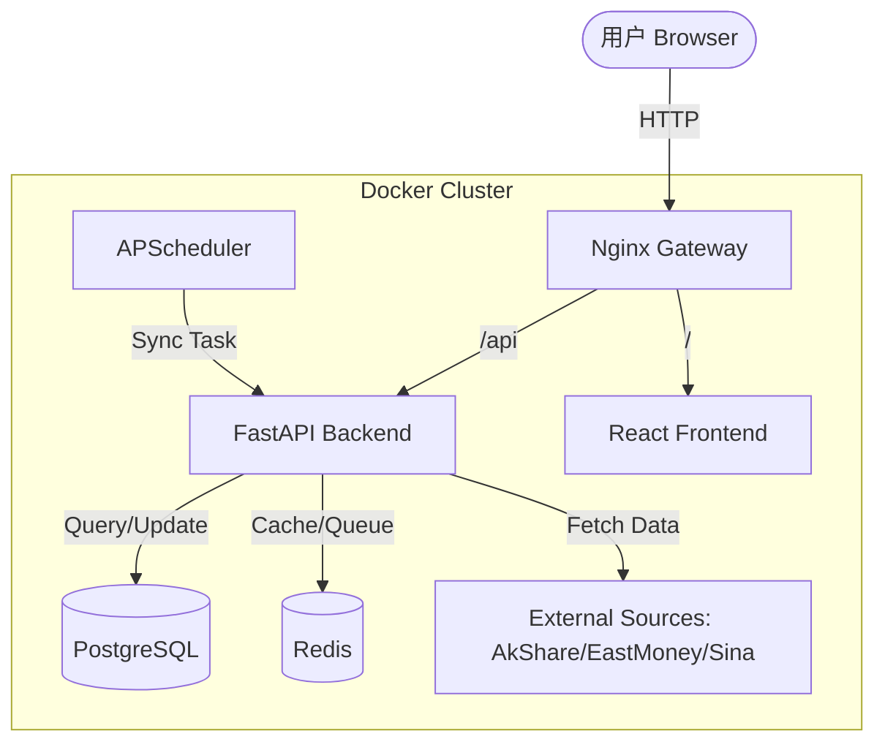

# A股可视化选股与量化交易系统 架构设计说明书

## 1. 总体架构

### 1.1 系统架构图
系统采用 **微服务架构 (Microservices)** 思想设计，核心层分为 **Frontend**, **Backend**, **Database**, **Cache**, **Crawler**。部署方式为 **Docker Compose** 编排。



### 1.2 技术选型
-   **Frontend**: React 18 + Vite + TypeScript + Tailwind CSS (Shadcn/ui) + ECharts
-   **Backend**: Python 3.11 + FastAPI + SQLModel (SQLAlchemy) + Pandas
-   **Database**: PostgreSQL 15 (TimescaleDB 扩展可选)
-   **Cache**: Redis 7
-   **Scheduler**: APScheduler (Built-in FastAPI process)

## 2. 详细设计

### 2.1 数据层设计 (Database Schema)
数据库核心实体包括：
-   **Stock (股票基础表)**: `id, symbol, name, market, industry, market_cap, pe_ratio, pb_ratio`
-   **DailyPrice (日线行情表)**: `id, stock_id, trade_date, open, high, low, close, volume, amount`
-   **FinancialMetric (财务指标表)**: `id, stock_id, report_date, revenue, net_profit, roe, debt_ratio`
-   **FactorValue (因子表)**: `id, stock_id, factor_date, momentum, volatility, liquidity`
-   **PatternResult (形态识别结果)**: `id, symbol, pattern_name, detected_date, score, success_rate`
-   **BacktestResult (回测结果)**: `id, strategy_name, symbol, start_date, end_date, annual_return, max_drawdown, sharpe, win_rate`
-   **ScreeningPreset (选股预设)**: `id, name, payload_json`

### 2.2 接口设计 (API Design)
RESTful API 风格设计：
-   `GET /api/v1/stocks`: 获取全市场股票列表
-   `POST /api/v1/data/sync/*`: 触发数据同步任务
-   `POST /api/v1/data/daily`: 获取指定股票日线数据
-   `POST /api/v1/screening/run`: 执行选股查询
-   `POST /api/v1/backtest/run`: 执行策略回测
-   `POST /api/v1/patterns/scan`: 执行形态扫描

### 2.3 核心算法逻辑

#### 2.3.1 量化策略 (Quantitative Strategies)
采用 Pandas 向量化计算回测指标。例如均线交叉策略：
```python
def ma_cross(df, short=5, long=20):
    df['ma_short'] = df['close'].rolling(short).mean()
    df['ma_long'] = df['close'].rolling(long).mean()
    df['signal'] = np.where(df['ma_short'] > df['ma_long'], 1, 0)
    return df
```

#### 2.3.2 选股筛选 (Screening)
筛选条件转换为 SQL `WHERE` 子句或 Pandas 过滤条件。为了性能，常用指标（如 PE, PB, Market Cap）存储在 `Stock` 表索引字段中，直接通过 SQL 快速筛选；复杂指标（如形态、技术指标值）通过预计算存储在 `FactorValue` 或 `PatternResult` 表中。

#### 2.3.3 形态识别 (Pattern Recognition)
基于极值点（Local Extrema）识别算法。
-   **头肩顶**: 寻找连续三个峰值，中间峰值最高，两侧峰值较低且接近。
-   **双重底**: 寻找两个相近的低谷，中间夹一个峰值。

## 3. 部署架构
-   **Docker Compose**: 定义了 `frontend`, `backend`, `db`, `redis` 四个服务。
-   **Volume**: `postgres_data` 和 `redis_data` 持久化存储数据。
-   **Network**: 内部网络隔离，仅暴露 80 (Frontend) 和 8000 (Backend API, 可选) 端口。

## 4. 安全设计
-   **Authentication**: JWT (JSON Web Token) 基于 Header `Authorization: Bearer <token>` 认证。
-   **Password**: 使用 bcrypt 哈希存储用户密码。
-   **Rate Limiting**: Nginx 层限制请求频率，防止恶意爬虫。
