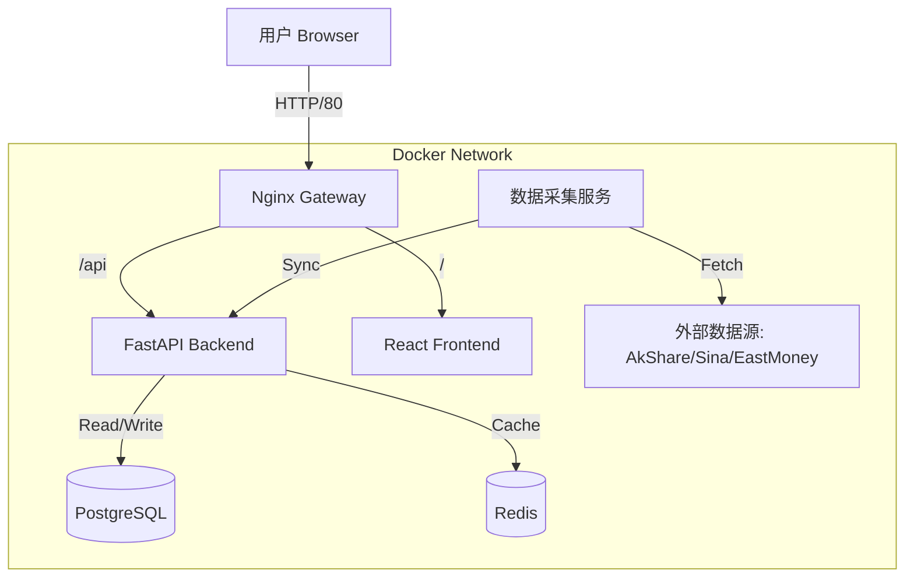

# A股可视化选股与量化交易系统 Implementation Plan

## 1. 核心目标
构建一个现代化、容器化、高颜值的A股量化分析平台，集成多数据源获取、本地化存储、可视化选股、策略回测等功能。严格遵守 `Prompt2Repo` 工程规范，实现 100% Docker 化交付。

## 2. 技术栈选型 (Technology Stack)

### 2.1 Frontend (前端)
- **Framework**: React 18 + Vite (极致性能与开发体验)
- **Language**: TypeScript (强类型保障)
- **UI Library**: Shadcn/ui + Tailwind CSS (现代化、极致审美、响应式)
- **State Management**: Zustand (轻量级状态管理)
- **Data Visualization**: ECharts (专业金融K线图、交互式图表)
- **Networking**: Axios + TanStack Query (React Query) (高效数据请求与缓存)

### 2.2 Backend (后端)
- **Framework**: FastAPI (高性能异步 Python 框架，自动生成 Swagger 文档)
- **Language**: Python 3.11
- **Database ORM**: SQLModel (基于 SQLAlchemy，结合 Pydantic，完美契合 FastAPI)
- **Data Analysis**: Pandas, NumPy (金融数据处理标准库)
- **Data Source**: AkShare (主源), Tushare (备用), Scrapy/Requests (自定义爬虫)
- **Task Scheduler**: APScheduler (定时任务：盘后数据同步)

### 2.3 Database & Infrastructure (基础设施)
- **Database**: PostgreSQL 15 (处理金融时序数据性能优异)
- **Cache**: Redis 7 (缓存热点数据、高频行情)
- **Containerization**: Docker + Docker Compose (全栈容器化)
- **Reverse Proxy**: Nginx (前端服务与 API 聚合)

## 3. 系统架构设计 (System Architecture)



### 3.1 目录结构 (Directory Structure)
```
momentum/
├── frontend/                # 前端项目 (React+Vite)
│   ├── src/
│   │   ├── components/      # UI组件
│   │   ├── pages/           # 页面路由
│   │   ├── lib/             # 工具类 (Axios等)
│   │   └── hooks/           # 自定义Hooks
│   ├── Dockerfile           # 前端构建镜像
│   └── nginx.conf           # Nginx配置
├── backend/                 # 后端项目 (FastAPI)
│   ├── app/
│   │   ├── core/            # 核心配置
│   │   ├── models/          # 数据库模型 (SQLModel)
│   │   ├── api/             # API 路由
│   │   ├── services/        # 业务逻辑 (爬虫、回测、选股)
│   │   └── main.py          # 入口文件
│   ├── requirements.txt     # 依赖清单
│   └── Dockerfile           # 后端运行镜像
├── docker-compose.yml       # 容器编排
├── dev.sh                   # (可选) 开发脚本
└── README.md                # 项目文档
```

## 4. 数据库设计 (Database Schema Concept)

### 4.1 核心表结构
1.  **StockBasic**: 股票基础信息 (代码, 名称, 行业, 上市日期)
2.  **DailyBar**: 日线行情数据 (日期, 开高低收, 量, 额, 换手率)
3.  **Financial**: 财务指标 (季度, PE, PB, ROE, 净利润增长率)
4.  **StrategyConfig**: 策略配置信息 (策略类型, 参数JSON)
5.  **BacktestResult**: 回测记录 (策略ID, 开始结束时间, 总收益, 最大回撤)

## 5. 核心模块实施细节

### 5.1 数据获取与存储 (Data Module)
- **设计**: 使用 `Service` 层封装数据获取逻辑。
- **实现**: 
    - `DataCollector`: 负责调用 AkShare 接口或爬虫。
    - `DataManager`: 负责数据清洗、入库、去重。
    - **Update Mechanism**: 每日 15:30 自动触发增量更新。

### 5.2 量化策略引擎 (Strategy Engine)
- **设计**: 抽象 `BaseStrategy` 类，实现 `generate_signals(df)` 和 `backtest(df)` 方法。
- **内置策略**: 
    - `MaCrossStrategy` (均线交叉)
    - `MomentumStrategy` (动量)
    - `MeanReversionStrategy` (均值回归)
    - ... (共10种)
- **回测**: 向量化回测 (Vectorized Backtesting) 以保证 Web 端响应速度 (要求 < 5秒)。

### 5.3 选股器 (Screener)
- **QueryBuilder**: 前端动态构建 JSON 查询条件。
- **Backend Translator**: 将 JSON 转换为 SQL `WHERE` 子句 (使用 SQLModel/SQLAlchemy 表达式)。
- **Performance**: 对核心字段 (Code, Date, Industry) 建立索引。

### 5.4 界面交互 (UI/UX Redesign - Light Futuristic)
- **Visual Style**:
    - **Theme**: 现代未来感浅色系 (Light Futuristic)。
    - **Background**: 微妙的渐变背景 (Subtle Gradients)，避免纯白单调。
    - **Colors**: 低饱和度主色调 (Ice Blue / Soft Grey)，配合鲜明的涨跌色 (红/绿)。
- **Micro-Interactions**:
    - **Feedback**: 按钮、卡片、链接必须有 Hover/Active 状态。
    - **Loading**: 数据加载时展示 Skeleton 或 Spinner。
- **Components**:
    - **Sidebar**: 悬浮式浅色磨砂玻璃效果 (Light Glassmorphism)。
    - **Cards**: 白色背景 + 柔和阴影 (`shadow-sm`/`shadow-md`) + 大圆角 (`rounded-2xl`)。
    - **Layout**: 增加 Padding/Margin，强化呼吸感。
- **Localization**: 全局汉化 (Text, Placeholders, Tooltips)。

## 6. 验证计划 (Verification Plan)
- **Unit Tests**: 后端核心逻辑测试 (API 响应格式, 回测计算准确性)。
- **Integration Tests**: Docker 容器间连通性测试 (Frontend -> Backend -> DB)。
- **Visual Tests**: 确保 K 线图渲染正确，无数据时显式骨架屏。

## 7. 风险控制与合规
- **反爬虫**: 在 `DataService` 中增加随机 User-Agent 和请求间隔。
- **数据源**: 优先使用开源接口 (AkShare)，避免商业版权纠纷。
- **本地化**: 所有数据本地存储，不依赖实时外部网络进行回测。
